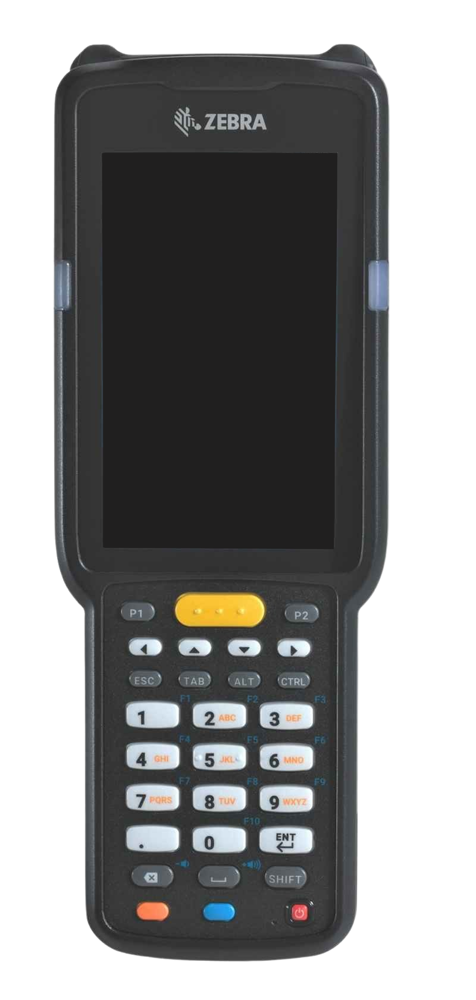

# Zebra Developer Skins for Android

These Android emulator skins allow developers to create custom virtual devices for Zebra mobile computers and barcode scanners using real high quality background photos.

## Included Products

* Zebra MC33 Series Long Range Barcode Scanner
* More coming soon!

## How to Use

1. Clone this repository locally.
2. Open Android Studio and go to the **Device Manager**.
3. Create a new device using the suggested device specs.
4. For default skin, select `zebra-devskins/device_name` where `device_name` is the folder for the desired device skin.
5. Click Finish and run the emulator.

## Specifications

| Device Name | Skin Name | Type | Screen Size | Resolution | RAM | Buttons | Keyboard | States | Cameras |
| ------- | --- | --- | --- | --- | --- | --- | --- | --- | --- |
| Zebra MC33 Series Long Range Scanner | zebra-mc330k | Phone/Tablet | 4" | 480 x 800 px | 4 GB | No | Yes | Portrait | No Cameras |

---

Note: Button functionality is currently desired but not yet supported. More to come!
