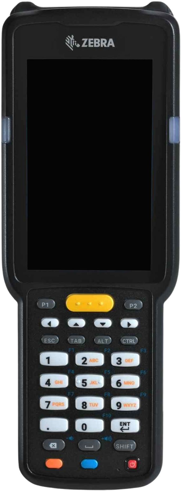
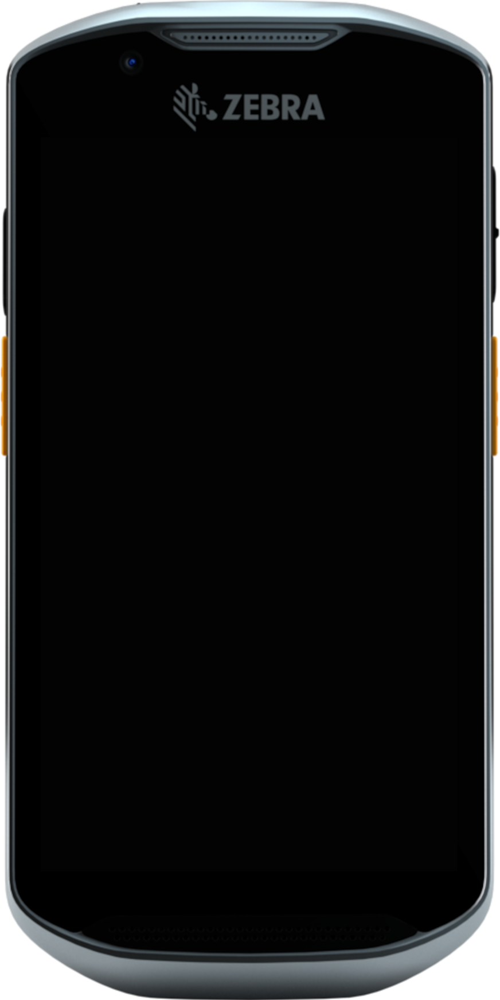
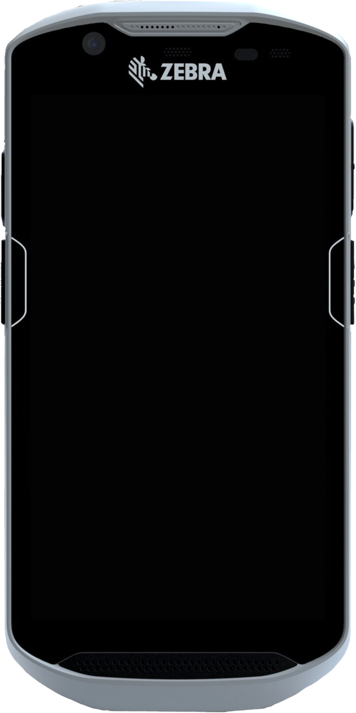

# Zebra Developer Skins for Android Emulator

These Android emulator skins allow developers to create custom virtual devices for Zebra mobile computers and barcode scanners using real high quality background photos.

## Included Products

* Zebra MC33XX Series Mobile Computer
* Zebra TC5X Series Mobile Computer
* Zebra TC5X Series Rugged Mobile Computer

  

## How to Use

1. Clone this repository locally.
2. Open Android Studio and go to the **Device Manager**.
3. Create a new device using the suggested device specs.
4. For default skin, select `zebra-devskins/device_name` where `device_name` is the folder for the desired device skin.
5. Click Finish and run the emulator.

---

## Specifications

| Device Name | Skin Name | Type | Screen Size | Resolution | RAM | Buttons | Keyboard | States | Cameras |
| ------- | --- | --- | :---: | :---: | :---: | :---: | :---: | :---: | :---: |
| MC33XX Series Mobile Computer | zebra-MC33XX | Phone/Tablet | 4" | 480 x 800 px | 4 GB | No | Yes | Portrait | No Cameras |
| TC5X Series Mobile Computer | zebra-TC5X | Phone/Tablet | 5" | 720 x 1280 px | 4 GB | No | No | Portrait | No Cameras |
| TC5X Series Rugged Mobile Computer | zebra-TC5X-rugged | Phone/Tablet | 5" | 720 x 1280 px | 4 GB | No | No | Portrait | No Cameras |

---

Note: Button functionality is currently desired but not yet supported. More to come!
