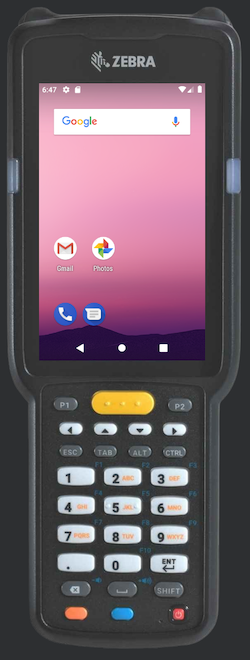

# Mobile Skins

This repository is for custom device skins for the Android Virtual Device Emulator. It will be expanded as necessary to include non-standard mobile devices.

## How to Use

1. Clone this repository locally.
2. Open Android Studio and go to the **Device Manager**.
3. Create a new device using the suggested device specs.
4. For default skin, select `mobile-skins/device_name` where `device_name` is the folder for the desired device skin.
5. Click Finish and run the emulator.

## Skins Included

| Device Name | Type | Screen Size | Resolution | RAM | Buttons | Keyboard | States | Cameras | Skin |
| --- | --- | --- | --- | --- | --- | --- | --- | --- | --- |
| Zebra MC33 Long Range Scanner | Phone/Tablet | 4 inch | 480 x 800 px | 4 GB | | X | Portrait | No Cameras | zebra-mc330k |

